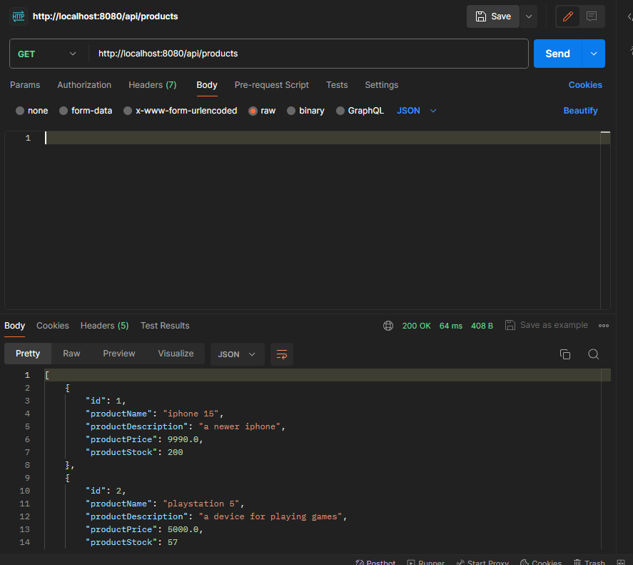
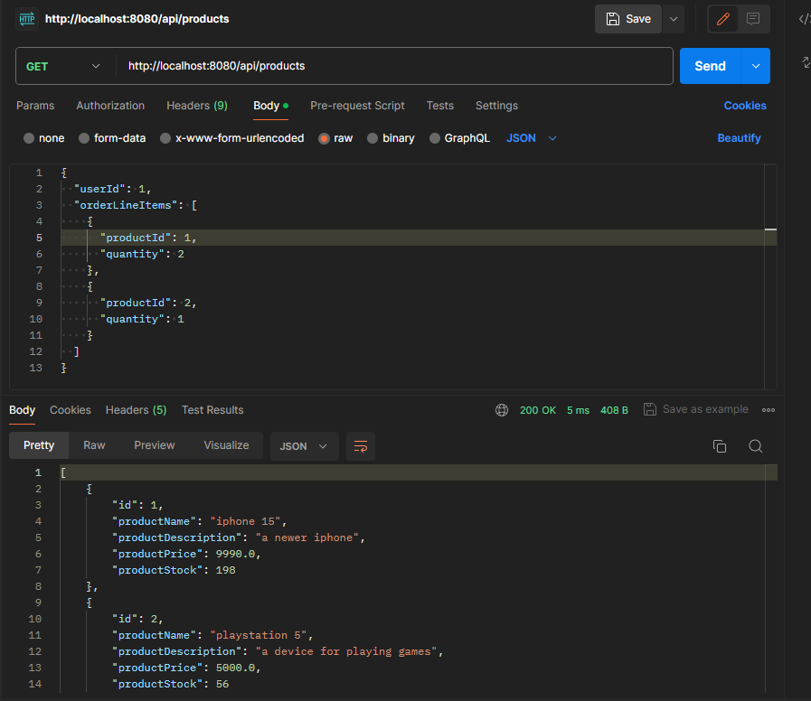

# Overview
This is an application that is run on a h2 database, therefore when starting the project, the databases will be empty, and will need a post to each databbase through eg. postman


Here are some examples of what you can 

- product: POST http://localhost:8080/api/products
```

  {
    "productName": "iphone 15",
    "productDescription": "a newer iphone",
    "productPrice": 9990,
    "productStock": 200
  }
```
```
  {
    "productName": "playstation 5",
    "productDescription": "a device for playing games",
    "productPrice": 5000,
    "productStock": 57
  }
```

then, when doing a GET to the same adress, it should look like this:


- user: POST http://localhost:8081/api/users

```
{
    "userName": "newUser",
    "email": "newUser@example.com",
    "password": "securePassword",
    "role": "User"
}
```

- order: POST http://localhost:8082/api/orders
```
{
  "userId": 1,
  "orderLineItems": [
    {
      "productId": 1,
      "quantity": 2
    },
    {
      "productId": 2,
      "quantity": 1
    }
  ]
}

```
The rabbitMQ queue should decrease the stock of the product in the product service, by the quanity a user orders.

I had some problems with rabbitMQ. For some reason, the Queues only sometimes go through, and they usally take some time to do so. I have tried to look into this, but can't find a solution sadly.



here is a GET request to http://localhost:8080/api/products, after the POST to orders. As you can see, two has been reduced from the stock of the first product, and one of the second. This matches what was ordered in the POST to the orders service.